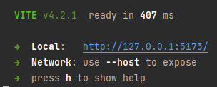

## Graduaatsproef | Shana Tuyaerts 2022-2023
### <u>Landingspagina WhatsApp Smstools</u>
Welkom!

Op de landingspagina wordt informatie vertoond m.b.t. de WhatsApp-dienst, hierbij worden volgende vragen beantwoord:
- 'Wat is het?'
- 'Wat doet het?'
- 'Hoe werkt het?'

Daarnaast zijn er ook de voordelen en mogelijkheden te raadplegen.<br>

Op deze landingspagina heeft de eindgebruiker de mogelijkheid om te ervaren hoe het is om een test-sms te versturen in een automatische chat.<br>
Dit kan dankzij een QR-code (desktop) of via een knop (mobile)<br>
Daarnaast kan een geschatte prijsberekening worden uitgevoerd m.b.t. het versturen van bulk sms'en bij Smstools.

Tot slot kan de eindgebruiker met vragen terecht bij het bedrijf via een contactformulier op de landingspagina.

<hr>
<i>Het doel van deze graduaatsproef is het bouwen van een landingspagina ter ondersteuning van de huidige Smstools website. Deze informatie zal beter begrijpelijk zijn voor de bezoekers van deze pagina. Naast het Informatieve aspect van deze pagina zal men interactie kunnen met de landingspagina en de gewenste respons verkrijgen.</i>
<hr>

### In onderstaande URL zitten volgende bestanden:
https://drive.google.com/drive/folders/1RDzoBhJnoSfTFMrP8bi949-wBBBPCDWO?usp=sharing
- Visueel design landingspagina (ontwerpen) - Adobe XD en print screens landingspagina
- Bronnen (en bekeken bronnen)
- Aanbevelingen
- Scenario's test-sms
- Overige Photoshop en Illustrator bestanden voor de foto's
- Social media
- Logboek

<hr>

#### This template should help get you started developing with Vue 3 in Vite.
### Aanbevolen IDE-configuratie
[VSCode](https://code.visualstudio.com/) + [Volar](https://marketplace.visualstudio.com/items?itemName=Vue.volar) (and disable Vetur) + [TypeScript Vue Plugin (Volar)](https://marketplace.visualstudio.com/items?itemName=Vue.vscode-typescript-vue-plugin).

### Aanbevolen IDE-configuratie <i>(Recommended IDE Setup)</i>
[VSCode](https://code.visualstudio.com/) + [Volar](https://marketplace.visualstudio.com/items?itemName=Vue.volar) (and disable Vetur) + [TypeScript Vue Plugin (Volar)](https://marketplace.visualstudio.com/items?itemName=Vue.vscode-typescript-vue-plugin).

### Configuratie aanpassen (Customize configuration)
See [Vite Configuration Reference](https://vitejs.dev/config/).

<hr>

### <u>Indien de styling van de import van _base.scss niet doorkomt, in elk component zet je dan de import in commentaar en de variabelen uit commentaar. Dan komt de styling door.</u>

## Opstart van het project
<u>Om het project te kunnen starten/uit te voeren, moet je Node.js geïnstalleerd hebben op je desktop.</u>

### Te ondernemen stappen:
#### 1. Via volgende link installeer je de LTS versie van Node.JS
    https://nodejs.org/en

#### 2. Open het project in een text editor, e.g. Webstorm, Visual Studio Code, ...

<hr>

### Runnen van het project

#### 1. Navigeer naar de projectmap
Om de Vue app te starten, moet je eerst naar de projectmap navigeren waar alle project bestanden in zitten

    'cd pad/naar/projectmap'

#### 2. Om het project te runnen, heb je de **node-modules** map nodig. (project setup)
In deze map zitten alle geïnstalleerde pakketten, dit bevat alle geïnstalleerde modules van het project (e.g. Sass, Axios, ...)

    Open de terminal in de editor en type "npm install"

In de terminal zal je zien dat de node-modules map wordt geïnstalleerd en zal je deze ook in de mappenstructuur zien verschijnen

#### 3. Opstarten van de applicatie (Compileer en hot-reload voor ontwikkeling)
Om de applicatie te starten, vul je in de terminal volgende in:

    npm run dev

Je zal zien dat er een localhost url zal verschijnen, klik daarop en de applicatie zal openen. (zie afbeelding)



<hr>

#### Compileren en verkleinen voor productie

```sh
npm run build
```

<hr>

Hopelijk ben je goed geïnformeerd over de WhatsApp-dienst bij Smstools